# Car Rental Management System

## Introduction 

A car rental or car hire agencies are private companies that provide short-time leasing vehicles for a specified time with a fee to their customers. This is the definition of car renting.

In Sri Lanka, car rental service increasingly becomes the preferred option for most people, especially among students on campuses, universities, and families. But most of car rental organizations are using manual methods to store information of customers. And all of the work is been done in papers.

In order to make this paper works as computerized stuff, The Car Renting Management System was developed. The work of the renting process and other processes such as storing customer information, card details can be easily done using this car renting management system.

This provides a rich and fair working environment for the system admin. This Car Renting Management System is a desktop application that is used to handle paperwork inside the computer.

This software, called Car Renting Management System (CRMS), will allow the company to access its database securely and safely in a user-friendly environment.

The software can be customizable according to the business needs such as per day mileage units, driver salary and etc.

This application is pretty easy to get well on it since it has many easily understandable features. Therefore, the person who works in this system can quickly pick up the working methodologies.

There are many modules inside the system for different sorts of purposes.

### Programming Languages & Frameworks
- C#
- MySQL
- XML
- Bunifu
- Metro UI
- Mono Flat
- .NET Framework 4.6

## Configuration & Setup

**Step 01:-** Create a database on MySQL with the name of "rentcarsystem".

**Step 02:-** Export the database to the empty created database. Note: the database is found on the "1-database folder (rentcarsystem.sql)". Upload this database to the empty database on MySQL management panel.

**Step 03:-** Open the profile-files folder with Visual Studio and build then run the application.

### Login Information

#### Admin Login

- *Username:* kuna
- *Password:* 123

#### Staff Login

- *Username:* guna
- *Password:* guna123

## System Background

This Car Renting Management System has two types of accounts staff login and admin login. The admin has full power than the staff account.

The user interface of this system was created with the help of the Bunifu framework which is rich and good-looking user interface framework for C# windows from applications. This system also uses the Mono-Flat user interface Framework for textboxes and headers. Not only this but also, this system has used Metro framework for the First from loading. There are three types of user interface frameworks has been used in this system such as Bunifu, Mono-Flat and Metro.

This system is used MySQL database for data storing purpose. The name of the database is “rentcarsystem”. It has some tables inside it. XML is another technology that has been used inside the system.

In the MySQL database, only the data of cars, customers, booking details and other system data are stored. But in the XML, the system configuration such as settings and other system configurations data are stored.

The system uses .NET framework version 4.6. The reason for the 4.6 version of .NET framework is Bunifu user interface does not work on the earlier version of .NET framework. It works on newer version. Therefore, we have selected the newer version of .NET framework.

## Problem Statements

The process on searching the client details is slow if the company is using manual system and there are thousands of clients. Besides that, staffs have to record the booking manually and it is difficult to produce a monthly report or an annual report. Manual system does not allow client to booking online and hard to keep track on the record of rental cars.

### Objective

The main objective of this system is to provide convenience to the management team by developing a computerized system to make processes regarding car rental easier. In distinctive, the objectives of Car Renting Management System are:

- To enhance searching speed for all information such as client and rental.
- To provide customizable settings for the organization.  
- To provide report generation and analyses the rental of car to give better decision making.

### Project significance

CRMS sharply improve the searching speed of staffs, drivers and client’s details for the user because staff who works in the system can insert key word to search them. Besides that, Admin can get benefit because it manages the booking of cars by show available cars for client and always records every single booking to easy the company report so that admin and staff can just print the report. Admin also does not have to calculate the profit for cars owner because the system will produce report and calculate the profit sharing. CRMS also give client benefit because allow them make booking at anywhere and anytime before they want it.

## Entire function of the system

In this section, the entire function of the Car Renting Management System is going to explain from scratch. For the explanation purpose, the screenshots of the applications and some important code snippets will be used to demonstrate the function of the system.
This section will give a clear statement of the modules of the car renting management system with the perfect explanation. This car rental document has some more details information about the application.

### Essential Functions
- Car Management
- Customer Management
- Driver Management
- Booking Process
- Returning Car  
- Reports
- Profits Management
- Notifications => Notifies cars that have to return on the current date.

These are main functions that occurs inside the car renting management system. beyond this there are several other types of functions are occurred inside the system. This structure of this application is so different. Because this application uses MySQL and XML as the main component of the database. MySQL is used to store data about the car information or other bossiness details hence XML sore data about the car renting management system configurations.

## 01.Splash Screen

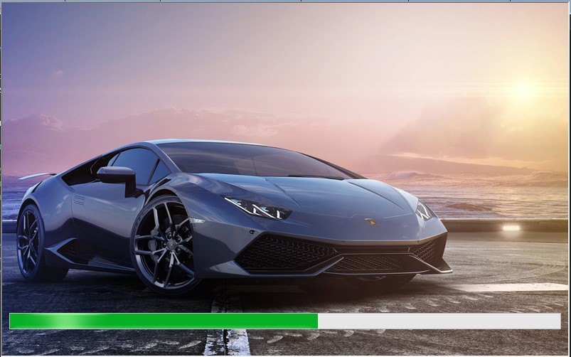

After the installation of this Car Renting Management System. It is the first form that loads to the entire Car Rental Application. When the first time it loads, it creates a folder called CRMS in the Users/account-Name/AppData/ Roaming/CRMS directives in order to maintain the system configurations.

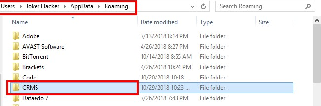

This is the CRMS folder. That will be created at the first time when we are launching the application. Inside the folder, there will be some XML and text files will be created in order to maintain the system settings and configurations. This is the main component of the application.

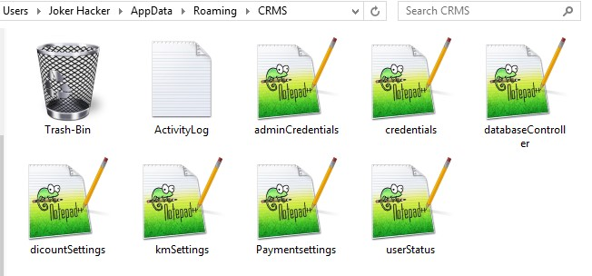

Inside the CRMS folder, these are some main files that will be created at the first times of opening the Car Rental application. There are 7 XML files created, First is a Text file and second is a trash-bin folder will be created. The trash-bin folder has the same functionalities like the Recycle-Bin in windows.

### Text Files

There is only one text file inside the CRMS folder called ActivityLog.txt That file stores activities with time and date such as add customer, database deletion and all most every activities that occurs inside the system. It also records the time and the date that the system turns on and turn off. Then We access and see the records via the Car rental System.

### Trash-Bin

The trash-bin folder has the same functionalities like the Recycle-Bin in windows. This trash bin is programmatically coded in that way. The purpose of this trash-bin is to protect the database and other important files of the system.

For an example we have an option inside the Car Rental system to delete the database. When the movement the Car Rental MySQL database is deleted. It backs up the database inside the trash-bin for safety purpose. In some circumstances, if we lose the Car Rental MySQL database. We can restore it from the trash-bin. Because it backs ups the database when it is deleted.

### XML Files

There are 7 XML files are used inside the system. Each of them has different purposes. The reason why we are using the XML files for system settings and configurations not using MySQL for that. This system is not developed for a one specific Car Rental shop. It is developed as a general system for different kinds of Car Rental shop. According to their needs, they can customize the system.
The business-related data are stored in the MySQL database. The System settings and configurations are stored in the XML files. But here comes one question?. If the Car Rental shop decided to change the computer. It means move the Car Rental system to another computer. They can back up the MySQL database easily. Then how can they back up the CRMS folder?.

**Answer:** They have two options, one is manually, copy the files but that is very difficult for end-users because, the CRMS folder is located inside the AppData directory. But fortunately, we have an option inside Car Rental system settings to ZIP and backup CRMS folder safely. We also have an option to restore the CRMS folder to the correct location inside the AppData safely. This concept will be again explained very well in the settings module later.

### XML files and its usages

- 01.adminCredentials: which stores the admin account credentials inside that XML files with encryption.

- 02.Credentials: which stores the credentials of staff accounts with encryption.

- 03.databaseController which is used to determine the MySQL database is turn on or turn off. Or the database is deleted or not.
- 04.discountSettings which stores the discount information about the system.

- 05.kmSettings. This one stores information about the mileage and kilo-meter settings for the car rental system.

- 06.PaymentSettings. This one contains information about the payment settings.

- 07.userStatus, This controller which users logged in. according to the user it provides the access key to the car rental system.

## 02.Security of the CRMS folder.

The CRMS folder has to be very secure in order to prevent any types of hacking attacks such as seeing the password of the Car Rental system, deleting the folder or changing the XML file’s content manually. Generally speaking, no one will do it.

### Encrypted the credentials

We have two encrypted XML files inside the CRMS folder that stores the credentials information. The reason why we are encrypting those files. Because, the attacker can go the location of the CRMS folder and see the password or username, if is not encrypted.

The encryption is very strong. Because we are using “256BitsOfRandomEntropy” method to encrypt the files. The encryption key is very strong. It combines all symbols, letters, numbers, and alphabetical character as encryption key.

### CRMS Service

CRMS Service is a windows service that has been developed to protect the CRMS folder from being deleted. This Service won’t allow the CRMS folder to be deleted. Because the CRMS folder contains most important files that are essential to run the application. This CRMS Protection Service will keep the file safe from being deleted.

### File written permission are blocked.

Sometimes the attacker can edit the XML files in order to make the system massed up. But by default. When the splash screen loaded the CRMS folder and its XML files are created. While they created they have restricted the file access mode to read only programmatically. But while we are writing any settings changes in the XML file via the Car Rental program. It changes the file access mode to write mode and after writing it change to read only mode. This keeps a really good security from changing the contents.

## 03. MySQL Database

The Business information are stored in the MySQL database. But the system settings and configurations are stored in XML files inside the CRMS folder. The database has some tables in order to maintain and save the data of the Car Rental system.

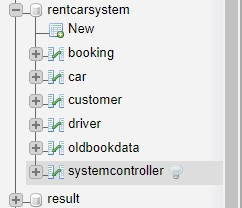

- booking: This table contains the reservation details. All of the booking information are kept inside this booking table.

- car: Inside the Car table, we stored only the car information.

- customer: Inside the customer table. the customer’s
information is stored.

- driver: inside the driver table driver information is stored.
- oldbookdata: This table contains old history of booking details.

- systemcontroller: This table contains some cashed information about the business data.

## 04. Company Registration

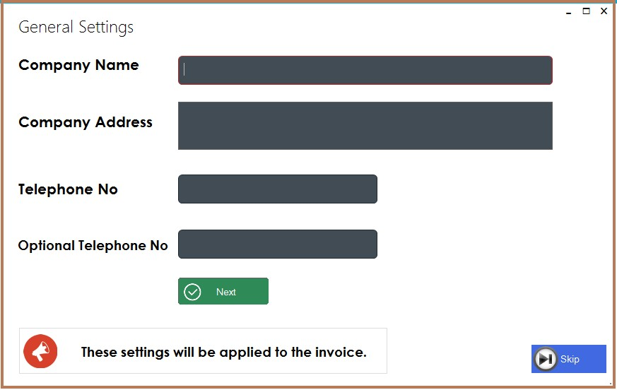

After the installation of the Car Renting Management System. This is the first form that the Car rental shop has to fill up. Here they have to enter their company name, address, phone numbers and etc. These details will be shown in the bill.

This form will only appear the first time. After they enter their details, all of the company details will be stored in an XML file. According to their length of their company name and address in the bill font size and paper size will be decided programmatically.

## 05. Choose Account Type.

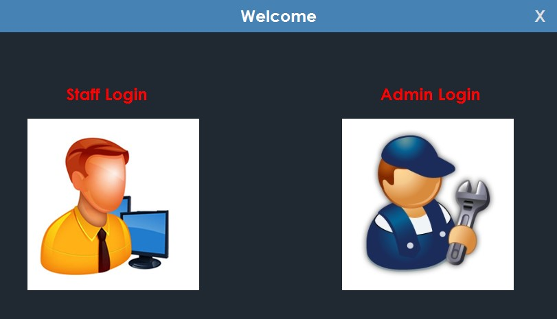

Like it is already mentioned, This Car Renting Management System has two types of accounts such as Staff and Admin. The first one is staff. Staff is nothing but a person who works on the system to enter car details, customer details, booking and etc. The staff cannot have privileges to access the system settings such as changing credentials or customizing the system.

The admin account is for the owner or the boss of the company. The admin has the full control over the system. The admin can have the privileges to change passwords usernames, turn on discount, change mileage settings, delete the database, back up the database, restore the database and etc. The admin has the full potential to customize the system according to their business needs. This Car Renting Management System has a lot of settings and configuration that will be discussed later.

## 07. Login

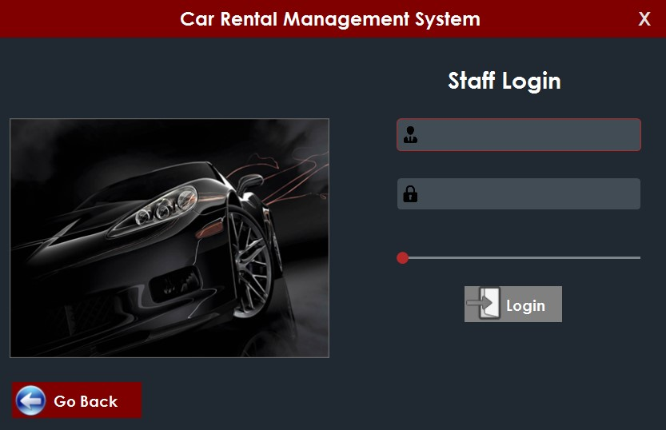

This is the login panel of the staff account. The login panel of the admin account is also similar to this but, only the name will be changed as admin login. We have a button on the left side to go back to the choose account  form.

If the password and username match in the XML file. The dashboard of the staff account will be open. If it is the admin login panel, the dashboard of the admin account will be opened.

## 08. Staff dashboard

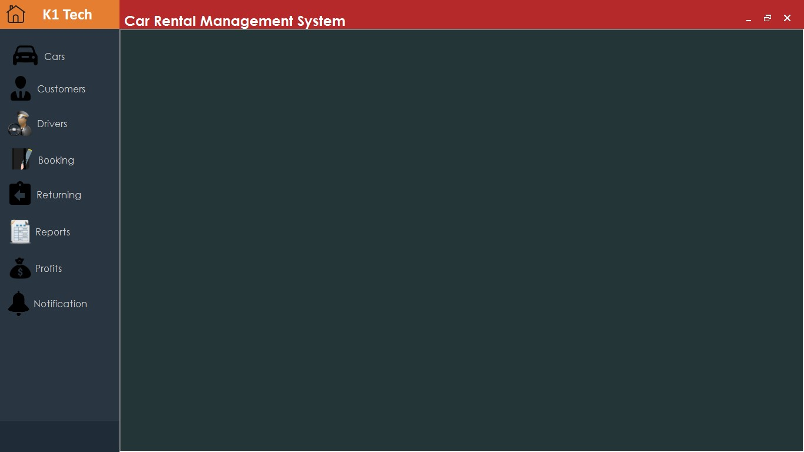

This is the dashboard of the staff account. In the staff account only the setting module will be missed. These are the modules that the staff has to work on. But the staff does not have access to the settings module. Only the admin will have the setting module shown.

## 09. Admin Dashboard

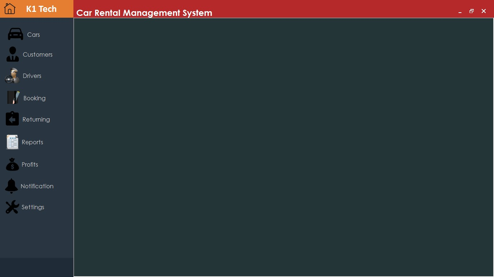

This is the admin dashboard. It contains all the privileges and modules. I prefer to explain the entire Car Renting Management System in the Admin account. Because it has all the modules in it.

### Modules

- Car
- Customer
- Driver
- Booking
- Returning
- Reports
- Profits
- Notification
- Settings

## 10. Error Message Box

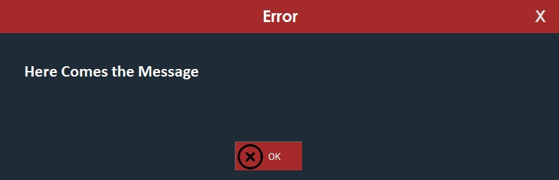

This is the error message box. If any validation or any other types of error occurs inside the system. This box will be shown instead of the traditional box. It was created to attract the user.

## 11. Success Message Box

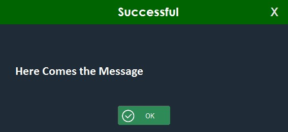

This box indicates that any successful messages such as insertion completed, or after the booking process and etc.

## 12.Confirm Box

## 13.Print Box

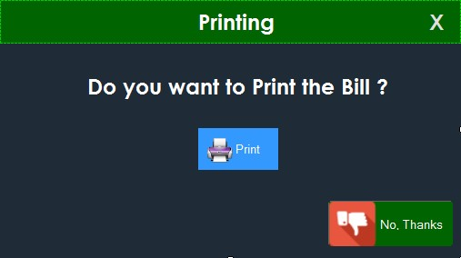

After booking process, this message box will appear to ask if the bill is need or not. If the user clicks the print button, the bill will be printed.

## 14.Car Module

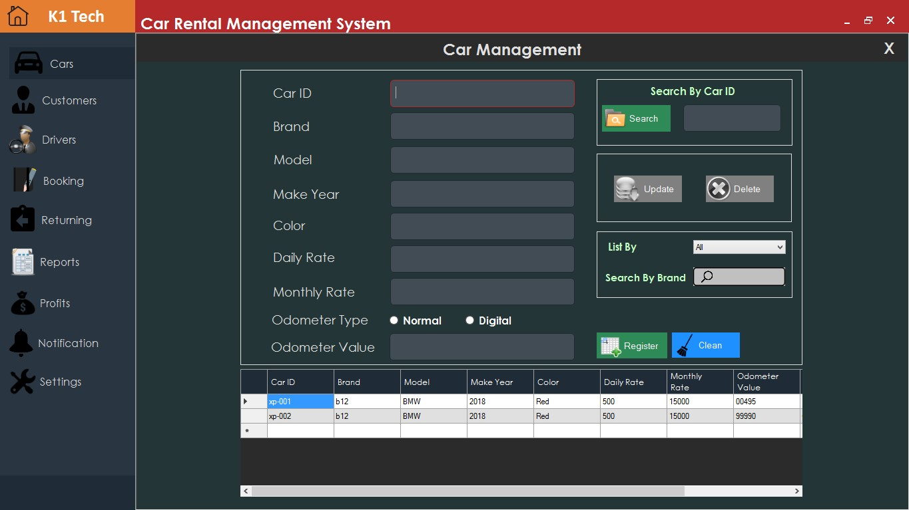

###  Functions

- Add cars
- Delete Cars – before deletion confirm box will be appear
- Update Car
- List car by Hired and Available
- Search by brand name
- Search by ID
- Data grid view is clickable

This module is used to register car into the database. It is well bug free module. For example, it has proper validations. It only allows the right data to be entered into the system. Bellow I have written some validations and bugs that have solved in this module. This module was tested very well.

#### Sample validation

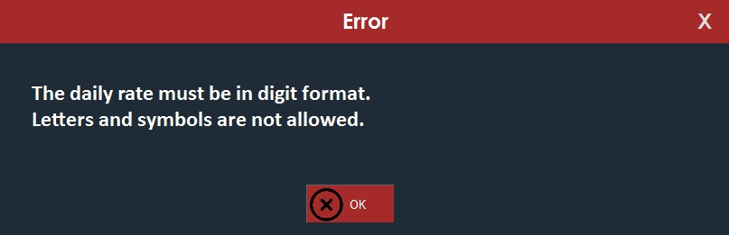

When the movement the user enters unallowed data to the filed. It will prompt this message box and shows the validation error.

##### Attributes of car
- Car ID
- Brand
- Model
- Make Year
- Color
- Daily Rate
- Monthly Rate
- Odometer Type (Normal or Digital)
- Odometer Value

This module is clean and clear. We have fixed all of the bugs and validation. The main scope of the module is to store the car details. Then this car details can be used in the booking module to book the car. Once the car has been booked. It changes the car status to “OUT”. This process will be explained further in the booking module.

## 15.Customer Module

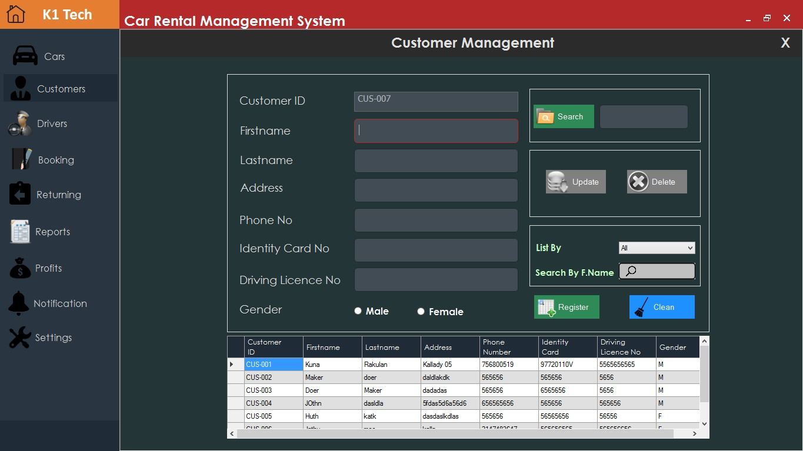

### Features

- Register Customer.
- Delete Customer - confirm box will appear.
- Update Customer
- List by (Male or Female)
- Search by First name
- Search by Last name
- Data grid view click able.

This module also has validation errors messages. This module is responsible for customer management. It contains information about customer details. This is the customer management section. All of the customer related staffs are stored here.

## 16.Driver Module

### Features

- Register Driver.
- Delete Driver - confirm box will appear.
- Update Driver
- List by (Male or Female)
- Search by First name
- Search by Last name
- Data grid view click able.

This module contains information about driver. This is the driver management module. This contains information about the driver. Drivers are not compulsory for renting. Renting can also take place without driver. If the driver is included to the renting. The customer needs to pay some extra money for the driver salary.

## 17.Booking Module

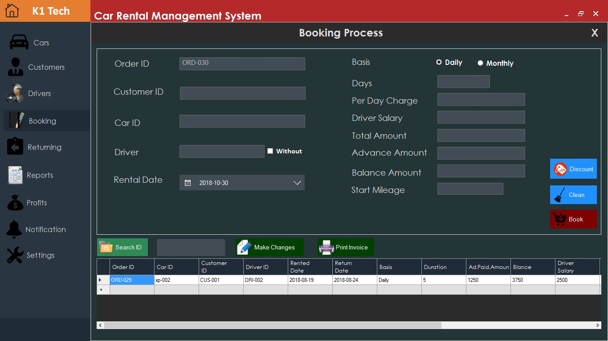

### Features
- Renting
- Print Bill
- Make changes to booking that has been done.
- Search by Id

This is the biggest and most important module in this system. It is very default to explain this module in this document. It looks like simple module but It has many complicated and many roles are taken place inside this module. Therefore, Better option is run the application and checkout this module for a movement.

Here, the maximum I try to explain the process of the booking module as fast as possible. It has many sub forms inside the booking module such as for selecting the customer, choosing the car, assigning drivers, printing, discount and more and more.

### Customer select form inside booking module

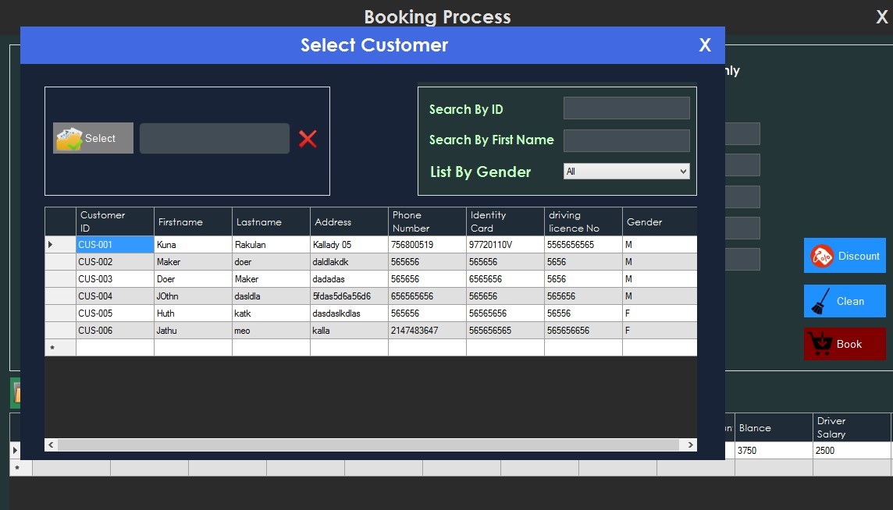

When the user clicks the customer textbox, this sub form will be open. Here we have to select the customer. Inside this sub forms, we can search by Id, search by first name and list by gender. The main purpose of this form is to select the customer.

### Car select Form inside booking module

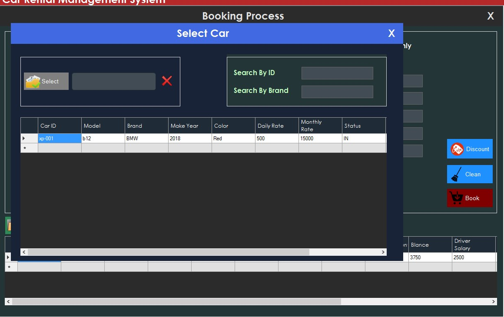

Note:- Same like customer select form, the only different is, this is car select form.

### Driver select form inside booking module.

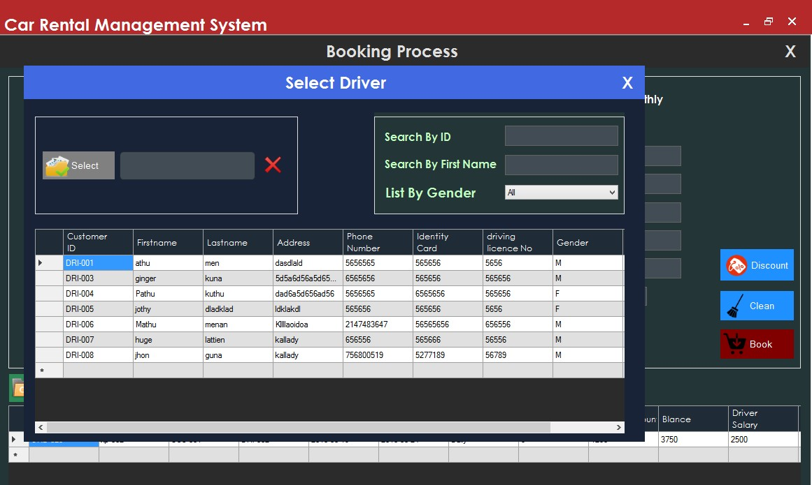

If the customer says. They want to rent without a driver. There is a checkbox near the driver textbox. If the system operator clicks that, they can get the car without the driver.

### Discount form inside booking module.

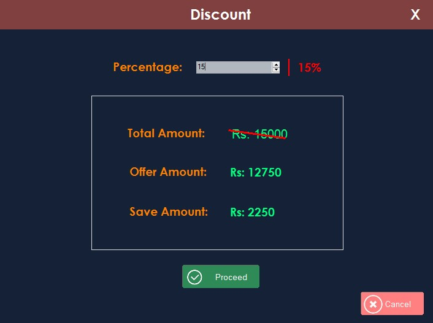

### Make change Form inside booking module.

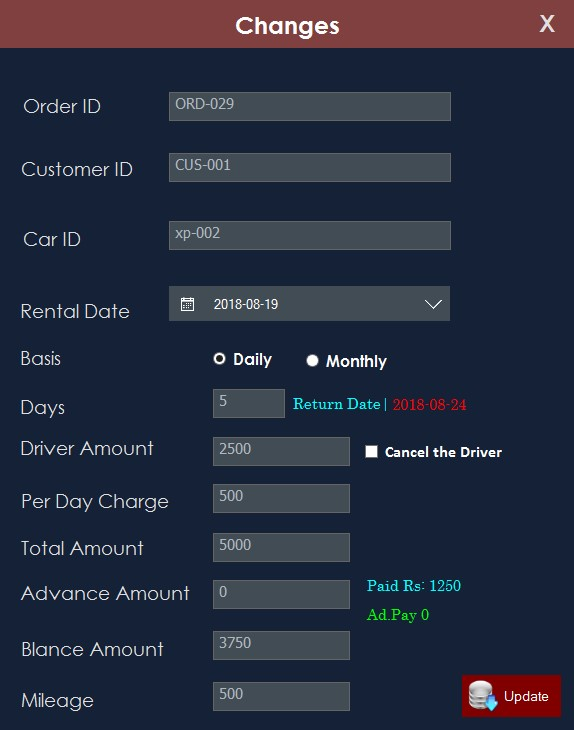

This form is used to make changes to already booked rentals. For an example, one customer comes and he says he wants to hire a car for 10 days. After one hour he comes and tell I want for 5 days. For that kinds of circumstances, this form would be very useful. It does the math correctly and gives the right output. It has also different options to switch such daily or monthly. When they change the math is worked as 100% right.

Not only that, sometimes, the customer would pay more advanced amount. When they change to days. The system needs to give the refund for them and print it in bill also. This type of math is worked 100% accuracy. This is the module I have worked hard and hard. Because It has many complicated algorithms inside this.  

### Bill (Invoice)

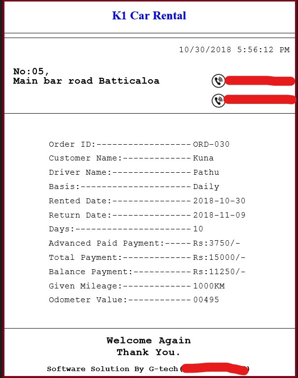

## 18. Returning

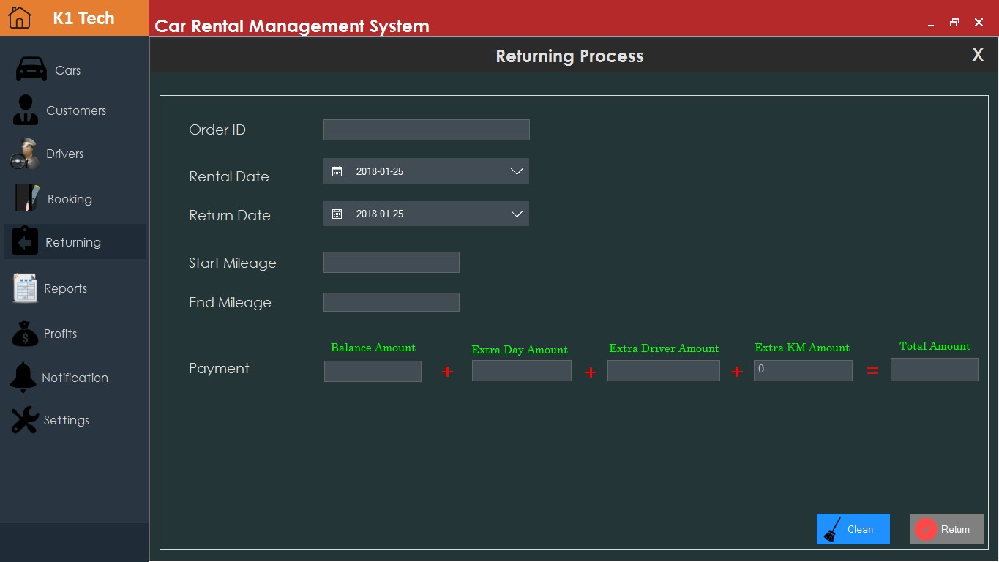

This is returning module. After the renting completed, when car arrives, extra mileage and extra driver salary have to be calculated in an accurate manner.

The system operator means the staff will see the odometer value and enters the value in the end mileage textbox. And select the date that the car arrived. These are the two things that the system operator has to do after the car arrived. The rest of the calculation works are done by the system automatically.

Finally, it prints a bill for them. In the new bill. Extra day and other kinds of essential things will be included.

## 19. Reports

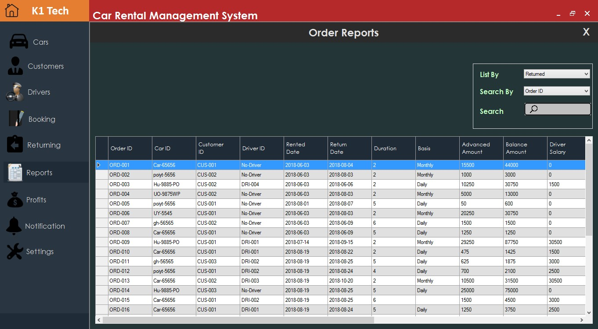

This is the report module of the system. It has many different kinds of searching methods to filter data.

### Features  

- List by returned car
- List by pending car
- Search by order ID
- Search by Customer ID
- Search by Car ID

Not only the booking details, we can also see the customer, car and driver details in this report. If we want to know customer, car or driver details, point the cursor on the cell and right click. The menu will be popup.

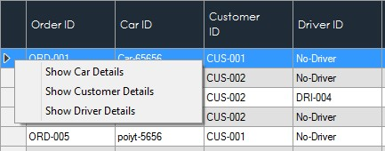

 ## 20.Profits

 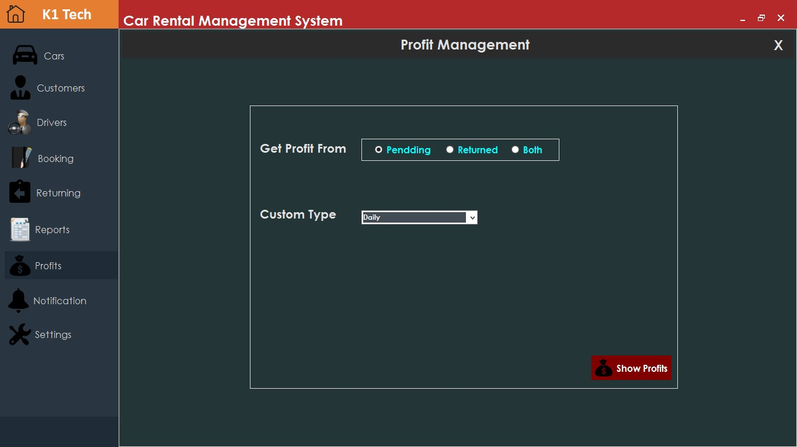

 ### Features
- Show profit by daily
- Show profit by monthly
- Specific Date
- Specific Month
- Show profit from pending reservations
- Show profit from returned reservations

This module the is profits management module. This is very useful for the organization to keep their finance details in a perfect manner. By using this module, They can maintain their business in a more accurate manner.

## 21. Notification

  

This is the notification section. This section does only one thing. It notifies the cars that has to be returned on the current date.

## 22. Settings

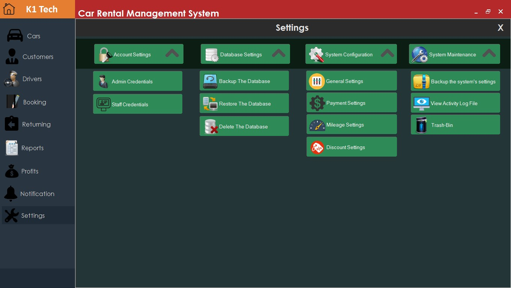

### Features
- Change staff account credentials
- Change admin account credentials
- Restore database
- Backup database
- Delete Database
- General settings
- Payment settings
- Mileage settings
- Discount settings
- Backup the system settings as zip file
- See the activity log file
- Trash-Bin

## Important Code Snippets

The Car Renting Management System has been built with 800000 thousand line of codes. The system was developed with more lines of C# codes. But in this section, we will only look the most important code snippets of the application.

## Social Links

- [Linkedin](https://www.linkedin.com/in/gunarakulangunaretnam)
- [Facebook](https://www.facebook.com/gunarakulangunaretnam)
- [Instagram](https://www.instagram.com/gunarakulangunaretnam)
- [Twitter](https://twitter.com/gunarakulangr)
- [Kaggle](https://www.kaggle.com/gunarakulangr)
- [TikTok](https://www.tiktok.com/@gunarakulangunaretnam)
- [Youtube](https://www.youtube.com/channel/UCjMOdgHFAjAdBKiqV8y2Tww)
